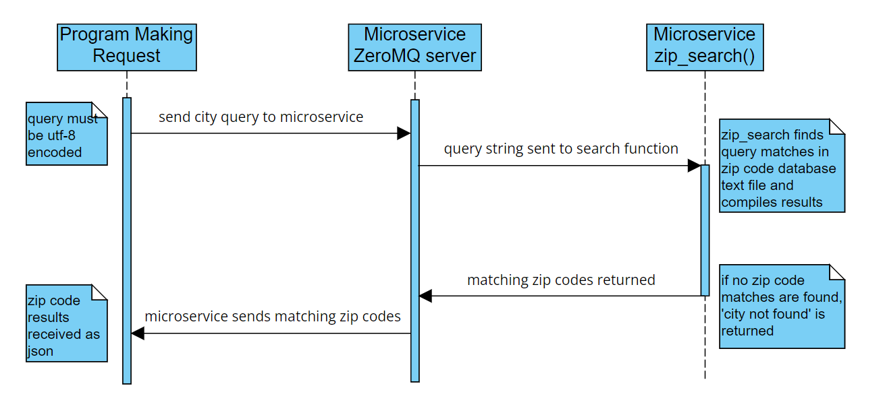

# cs_361_final_project
# city to zip code search microservice
# samuel smith

Description:
This microservice provides a search function to find valid zip codes based on a city query. The microservice will return all valid zip codes for any city that matches the search term, but will specify which city/state each zip code is matched to.

REQUEST Data:
In order to request data from the microservice, the requesting program must provide a single city query string as utf-8 encoded data over the ZeroMQ pipeline, via a local host IP address. An example call is provided below.

  socket.connect("tcp://127.0.0.1:8282")
  city_query = "corvallis"
  socket.send(city_query.encode("utf-8"))

RECEIVE Data:
The matching zip code data will be sent back over the same ZeroMQ pipeline, in JSON format. The results will be in dictionary form, with the city/state pair as the key and a list of valid zip codes for that city/state pair as the values. If the query has no matches, there will be a single key in the dictionary with the value ‘404’. Examples are below:

  Multiple city matches:
  {'Abilene, KS': ['67410'], 'Abilene, TX': ['79601', '79602', '79603', '79604', '79605', '79606', '79608', '79697', '79698', '79699']}

  Single match:
  {"Aaronsburg, PA": ["16820"]}

  No matches:
  {"404": "city not found"}

UML Diagram:

